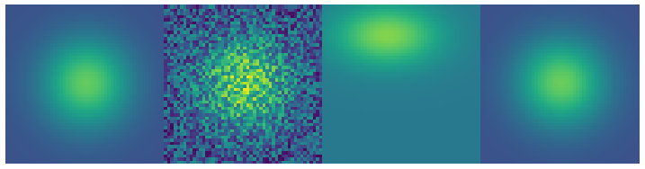

# astrofit
Creation: June 6th, 2018

Version : 1.0

Python library containing usual 2D functions and fitting algorithm. Feel free to run the different tests provided in the `tests` folder, it will help you to handle the different functions and classes. Be aware that you might find better libraries on GitHub!!! You can send your questions or your comments on https://groups.google.com/d/forum/lsfit

### Structure
* **astrofit/** _(library)_
  * **tests/** _(tests and examples)_
    * ... _(some tests)_
  * **\_\_init\_\_.py** _(init file)_
  * **circular_lib.py**  _(image centering and circular plots)_
  * **LSfit.py** _(fitting)_
  * **usual_functions.py** _(1D and 2D functions)_
  * **zernike.py** _(Zernike polynomials)_
* **setup.py** _(setup file)_
* **README.md** _(this file)_

### Content
* **gauss** and **moffat** : Gaussian and Moffat functions from **_R_** to **_R_**
* **gauss2D** and **moffat2D** : Gaussian and Moffat functions from [**_RxR_**] to **_R_**
* **LSfit** and **LSfit2D** : Least-square fitting between your noisy data and a parametric model (e.g. Gaussian or Moffat functions). Algorithm includes Levenberg-Marquardt method.
* **Zernike** : Class representing one or several Zernike polynomials

### Requires
`scipy`,`numpy` and `matplotlib` are required

### Examples
Example of fitting with LSfit. In this case, the physical process is described with a 2D Gaussian function `gauss2D`. Noisy data is observed, and we want to retrieve the Gaussian parameters (amplitude, width, center...) of the physical process. Image below shows from left to right:
1. Physical observable to retrieve
2. Noisy observed data
3. Initial guess
4. LSfit solution

