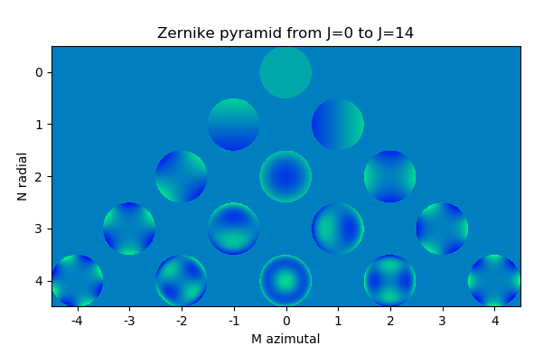

# astrofit
Creation: June 6th, 2018

Version : 1.1

Python library containing usual 2D functions and fitting algorithm. Feel free to run the different tests provided in the **tests/** folder, it will help you to handle the different functions and classes. Be aware that you might find better libraries on GitHub!!!

You can send your questions or your comments on https://groups.google.com/d/forum/lsfit. Please send me your remarks and comments, I would like to improve my code with your feedbacks. This is my first module, if installation is not working well don't hesitate to tell me. Eventually you might have to go to the **astrofit/** root directory to run the command line `import astrofit`, and then it should work 😉

### Structure
* **astrofit/** _(the library itself)_
  * **tests/** _(tests and examples)_
    * ... _(some tests)_
  * **\_\_init\_\_.py** _(init file)_
  * **circular_lib.py**  _(image centering and circular plots)_
  * **LSfit.py** _(fitting)_
  * **usual_functions.py** _(1D and 2D functions)_
  * **zernike.py** _(Zernike polynomials)_
* **images_readme/** _(images for examples presented in README)_
* **LICENSE** _(license file)_
* **README.md** _(this file)_
* **setup.py** _(setup file)_

### Content
* **gauss** and **moffat** : Gaussian and Moffat functions from **_R_** to **_R_**
* **airy2D** , **gauss2D** and **moffat2D** : Airy, Gaussian and Moffat functions from [**_RxR_**] to **_R_**
* **LSfit** and **LSfit2D** : Least-square fitting between your noisy data and a parametric model (e.g. Gaussian or Moffat functions). Algorithm performs a Levenberg-Marquardt minimization method with variable damping parameter.
* **LSparam** : A class to be used in LSfit. It allows to bound or lock some of your parameters during the fitting. 
* **Zernike** : Class representing one or several Zernike polynomials

### Requires
`math`, `scipy`, `numpy` and `matplotlib` are required

### Example LSfit
Example of fitting with LSfit. You can run this test using the file `astrofit/tests/test_LSfit.py`

For this test, the physical process is described with a 2D Gaussian function `gauss2D`. Noisy data is observed, and we want to retrieve the Gaussian parameters (amplitude, width, center...) of the physical process. Image below shows from left to right:
1. Physical observable to retrieve
2. Noisy observed data
3. Initial guess
4. LSfit solution

Parameter | Background | Amplitude | Sigma_X | Sigma_Y | X0 | Y0 
 --- | --- | --- | --- |--- |--- |--- 
True | 0 | 1 | 10 | 10 | 25 | 25 
Guess | 0.3 | 0.8 | 7 | 12 | 40 | 20 
LSfit | -0.003 | 1.02 | 9.82 | 10.2 | 25.2 | 24.9 

### Example Zernike

Hereunder, the Zernike pyramid for polynoms up to radial order N=4. Mind the axis convention.

